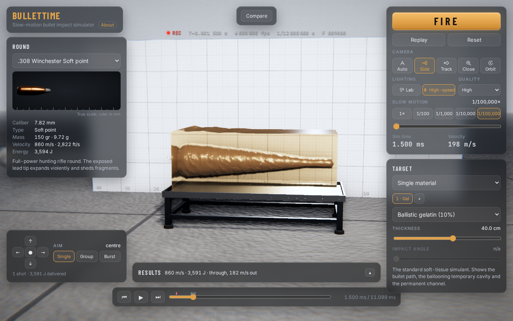
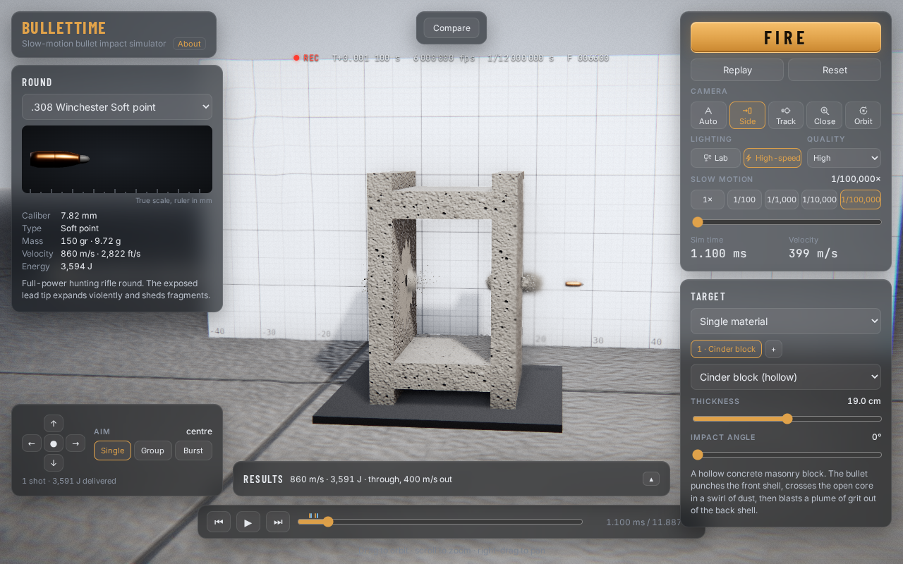
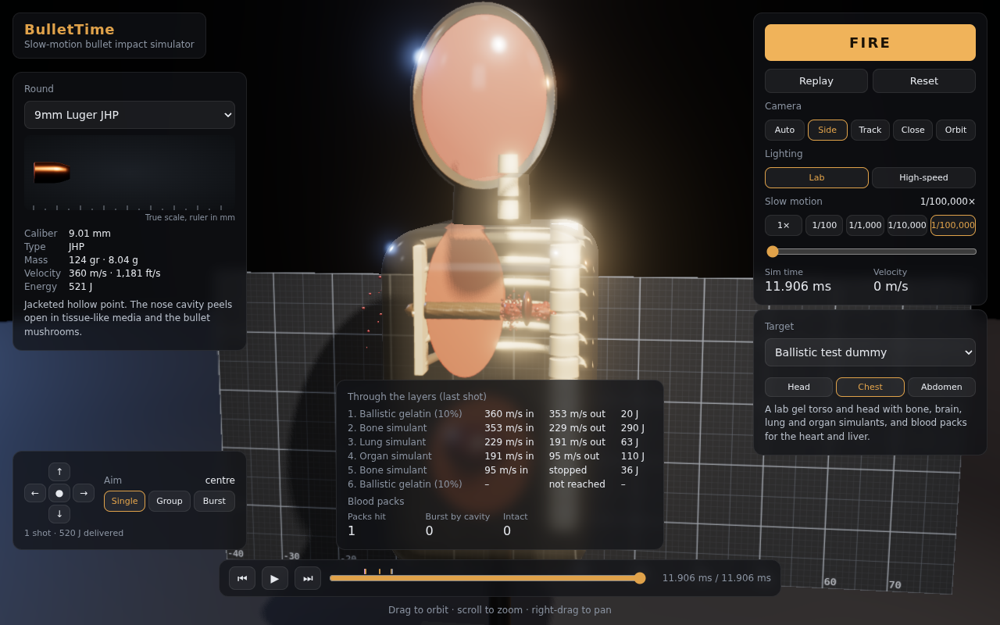
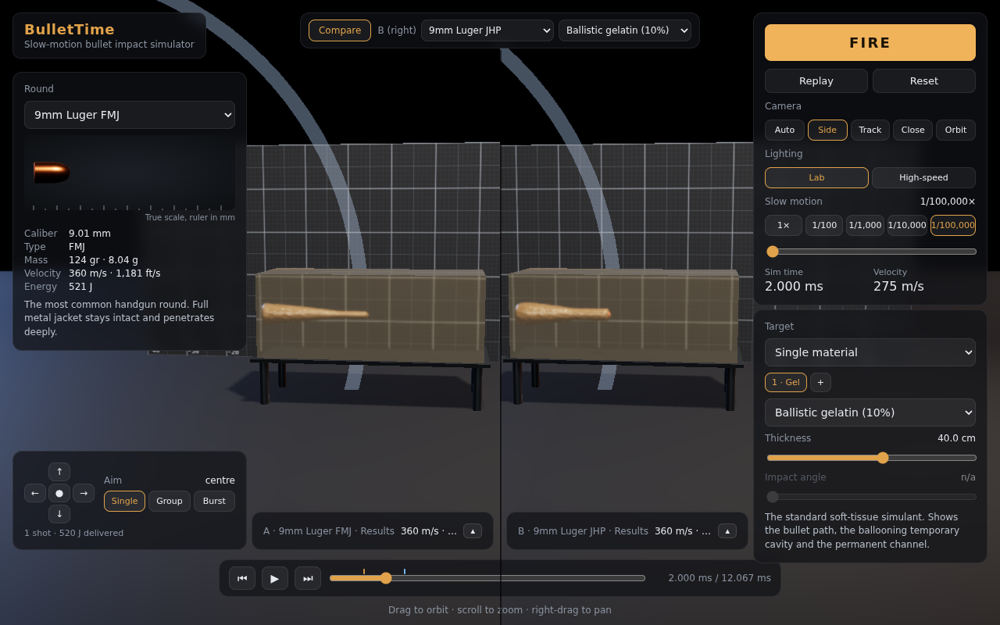
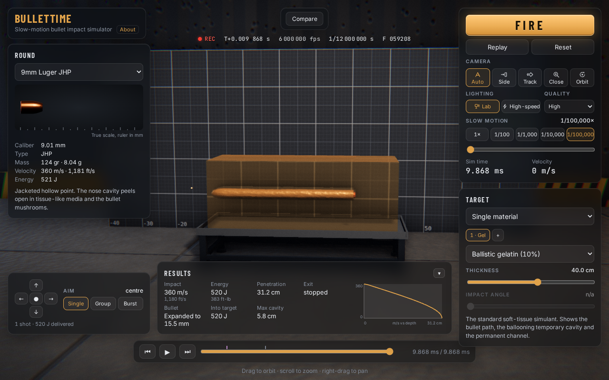
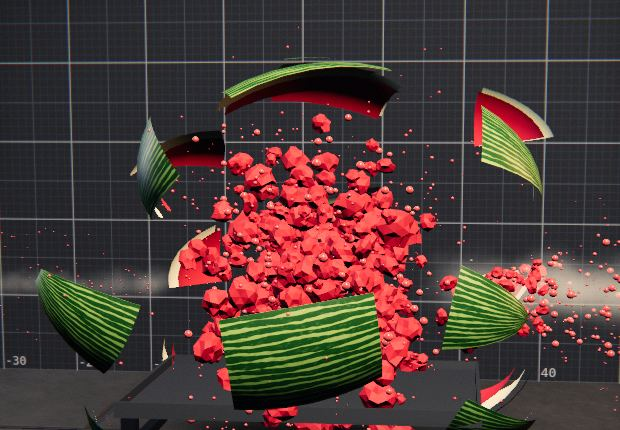
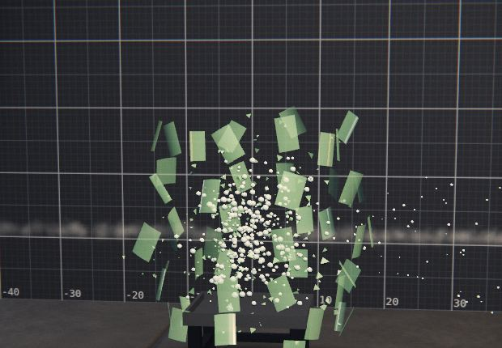
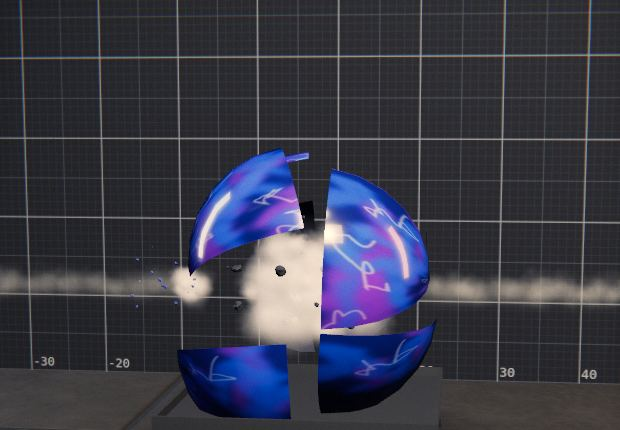
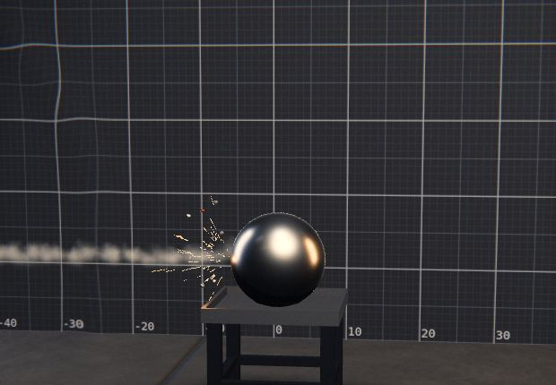
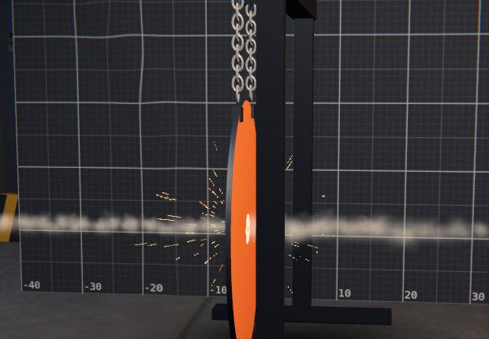

# BulletTime

A slow-motion bullet impact simulator in the browser. Pick a round and a target, press **Fire**, and watch the shot at up to 1/100,000× speed. You can see the bullet yaw, expand or fragment, the temporary cavity balloon through ballistic gel, glass crack, concrete crater and steel spark. Scrub back and forth through any moment of it.

**Live app:** https://jackgary86-dev.github.io/BulletTime/



> BulletTime is an entertainment and education tool. Its physics is plausible and tuned to published reference numbers, but it is a simplified model, **not** a validated engineering or forensic one. See *About* in the app.

## Features

- **Four simulators:** the game opens on a launcher with **Bullet**, **Artillery**, **Missile** and **Explosion**. Each is an experimental impact or blast test on the same material catalogue, with slow-motion playback, per-material effects and a results panel. Add `?mode=artillery` (or `bullet`, `missile`, `explosion`, `armor`) to the URL to skip the launcher. Progress is tracked in epic [#186](https://github.com/jackgary86-dev/BulletTime/issues/186).
- **Armor lab:** a fifth card on the launcher, a 2D teaching screen (no 3D renderer) showing a cut-away cross-section of metal plate as a munition defeats it: full-bore AP shot (De Marre ballistic limit, plugging), APFSDS long rods (Alekseevskii–Tate erosion), shaped-charge jets (density law, debris cone), HESH (stress-wave spall) and HE fragmentation (a spray of fragments that pit, embed or hole the plate), with ricochet and shatter on sloped plate, thrown pieces that bounce round a test room, spaced and layered plate stacks (up to four plates with gaps), and temperature, stress and pressure-wave overlays with legends and an energy bar. Pick a family and calibre (40–150 mm), plate material, thickness (10–300 mm), angle and arrangement, then fire; the results panel and a short explainer with a labelled diagram say what happened. Tracked in epic [#157](https://github.com/jackgary86-dev/BulletTime/issues/157). The equations, constants, sources and limits are in [docs/armor-models.md](docs/armor-models.md); models are simplified teaching models of impact outcomes only.
  - **Bullet:** .22 LR up to the 20 mm cannon shell.
  - **Artillery:** about 30 shells from 20 mm to 240 mm, grouped as autocannon, anti-tank and field guns, naval guns, mortars, recoilless rifles, howitzers and tank guns. AP and APFSDS shot punch through; HE shells burst on the face and throw fragments; HEAT fires a shaped-charge jet; HESH spalls the far side. Heavy targets (armour plate, reinforced concrete, packed earth) are added for them.
  - **Missile:** five basic airframes (light rocket, shoulder rocket, guided anti-tank, air-to-surface, cruise-class), each fitted with any of five warheads: shaped charge, tandem, blast-fragmentation, kinetic penetrator or thermobaric.
  - **Explosion:** a test bed of seven charges (flash, cased fragmentation, demolition block, satchel, linear shaped, thermobaric and incendiary) detonated at a stand-off from the material. The results show the TNT-equivalent yield and the overpressure at the face, and weak materials (glass, drywall, wood) fail before strong ones (concrete, steel).
  - Explosive numbers are plausible game values, not engineering data.
- **12 rounds** from .22 LR to .50 BMG: FMJ, hollow points, soft points, a fragmenting 5.56, buckshot, a slug, and a 20 mm HEI shell just for fun. Each has a true-scale 3D model and real-world data.
- **Targets:**
  - 10% ballistic gel and a water tank.
  - Pine and oak boards, plywood, drywall, cardboard and a phone book.
  - A concrete block, a brick wall and a hollow cinder block.
  - Mild and AR500 steel plate, thin sheet metal, an aluminium plate, a sandbag, glass, acrylic and ice.
  - Organic lab targets: gel with blood packs, MythBusters style, and a clinical **ballistic test dummy** with bone, brain, lung and organ simulants.
  - **Objects** to destroy: a bowling ball, a 10 cm steel ball, a steel gong on chains, a watermelon and a glass bottle of water. Round objects keep the aim inside their outline, and an off-centre shot crosses a shorter chord.
- **Layered targets:** stack up to four layers with air gaps, for example a wall, a wooden fence, a car door, auto glass or a cinder block in front of a gel block.
- **Physics:** a precomputed timeline at 1 µs steps. It models drag and material resistance, yaw, expansion, fragmentation, ricochet, shells of hollow targets, and the temporary and permanent wound cavity in gel.
- **Effects for each material:**
  - Gel and water: the cavity, splash and bubbles.
  - Wood: splinters and exit spall.
  - Concrete: craters and dust.
  - Steel: sparks and splatter. A bullet that punches through a plate sheds about half its mass as a wide cone of fragments, with a heavy spray of sparks and spall out the back.
  - Glass: radial and concentric cracks, and shards.
  - Organic targets: bursting blood packs and bone fragments.
  - Objects: the watermelon swells and bursts into rind and flesh, the bottle shatters round a burst of water, a rifle round cracks the bowling ball into chunks, the steel ball throws sparks and lead spray, and the gong shudders or is holed.
- **Playback:** slow-motion presets, frame stepping and a scrubber with event markers.
- **Camera presets:** auto, side, tracking, close-up and free orbit.
- **Lighting:** lab and high-speed (back-lit) modes.
- **Multiple shots:** aim anywhere on the face and fire single shots, groups or bursts. Each new shot meets the damage already in the target.
- **Results:** impact speed and energy, penetration, exit speed, the bullet's final state, peak cavity, energy into the target, a velocity-vs-depth chart, and per-layer and blood-pack details.
- **Compare:** two setups side by side on one synced clock.
- **Range challenge:** a shot-placement game. Aim through a swaying scope (hold Space to steady it), score 1 to 10 on each of 10 shots over 5 stages, from 9 mm into gel to .50 BMG into concrete, and watch every hit replay in slow motion. Your best score is remembered.
- **Quality:** Low, Medium and High, for laptops and tablets.

| Layered and hollow targets | Clinical test dummy |
| --- | --- |
|  |  |
| **Side-by-side comparison** | **Results panel** |
|  |  |

| Watermelon, .308 | Glass bottle, 5.56 | Bowling ball, .308 |
|---|---|---|
|  |  |  |
| **Steel ball, .308** | **Steel gong, .308** | |
|  |  | |

## Running it

You need Node 20.15 or newer.

```sh
npm install
npm run dev        # http://localhost:5173
npm test           # Vitest physics suite
npm run build      # typecheck + production build into dist/
npm run preview    # serve the production build
npm run build:itch # itch.io upload: release/bullettime-web-<version>.zip
npm run desktop    # build and open the desktop app
npm run dist       # desktop installer for this OS, into release/
npm run dist:steam # unpacked desktop app for a Steam depot, see steam/README.md
```

Every push to `main` is tested, built and published to GitHub Pages by `.github/workflows/deploy.yml`. Production builds use the base path `/BulletTime/`. Set `VITE_BASE=/` when building for a custom domain.

## Desktop app

The desktop app wraps the same build in Electron (`electron/main.cjs`), so it installs and runs offline. It asks for the high-performance GPU, ignores the GPU blocklist and never throttles in the background. F11 toggles fullscreen.

It defaults to the **Ultra** quality tier, which the web build also offers with `?ultra` in the URL:

- **Physics:** a 0.25 µs integration step instead of 1 µs, a keyframe every 2 µs instead of 5 µs, and twice as many temporary-cavity samples. The tuning baseline tests run at both resolutions.
- **Particles:** 1.6× the particles of High, with each look's cap doubled.
- **Rendering:** full device pixel ratio, 4096 px shadows, bloom, ambient occlusion and depth of field.

`npm run dist` builds the installer for the current OS: Windows NSIS `.exe`, macOS `.dmg`, Linux `AppImage` and `.deb`. Pushing a `v*` tag runs `.github/workflows/release.yml`, which builds all three on GitHub's runners and attaches them, plus the itch.io zip, to a draft GitHub release. The installers are unsigned: Windows SmartScreen and macOS Gatekeeper will warn until you add a code-signing certificate (`CSC_LINK`/`CSC_KEY_PASSWORD` secrets) and, for macOS, Apple notarization. The plan for that is in [docs/code-signing.md](docs/code-signing.md). Electron's and Chromium's own license files ship next to the executable.

`npm run smoke` is the desktop smoke test: it opens the built app in Electron on a fresh profile, passes the content warning, checks the launcher offers all four simulators, then loads each one and fires a shot. The release workflow runs it on all three platforms (under xvfb on Linux) before building the installers.

For Steam, `npm run dist:steam` builds the unpacked app per OS for SteamPipe; [steam/README.md](steam/README.md) has the Steamworks steps.

## Publishing on itch.io

`npm run build:itch` builds with relative paths into `dist-itch/` and zips it to `release/bullettime-web-<version>.zip`, with `index.html` at the root of the zip. CI also attaches that zip to every `main` build as the `bullettime-web-itch` artifact. The game makes no external requests, so it works inside itch.io's iframe.

On itch.io (needs your account):

1. **Create new project** → Kind of project: **HTML**.
2. Upload the zip and tick **This file will be played in the browser**.
3. Embed options: viewport **1600 × 900**, tick **Fullscreen button** and **Automatically start on page load** off (the content warning shows first anyway).
4. Under **Content**, tick the mature content box (simulated blood and human-shaped targets) and set the age rating questionnaire answers to match.
5. Set **Pricing** (paid, or "No payments" for a free demo) and publish.

## How it fits together

```
src/
  data/      catalogue and tuning: bullets.ts, artillery.ts, missiles.ts, explosives.ts, modes.ts, media.ts, physics.ts, stacks.ts, organic.ts, dummy.ts
  sim/       engine.ts (the physics), blastResponse.ts (what a blast does to each layer), session.ts (multi-shot), playback.ts, *.test.ts
  armor/     the Armor lab: materials, munitions, one penetration model per family (fullBore, longRod, jet, hesh, heFrag), ricochet.ts, fragments.ts (thrown pieces), fields.ts (temperature, stress, pressure, energy), stack.ts (layered plates), model.ts (the shared ArmorTimeline), section.ts, stackView.ts and sectionDraw.ts (the cross-section), validation.test.ts (pins the lab to published values)
  models/    procedural 3D: bullet.ts, targets.ts, dummy.ts, textures.ts
  fx/        impact effects, all pure functions of sim time so they scrub
  scene/     renderer, studio, camera director, post-processing, quality levels
  ui/        the panels, launcher.ts (the four simulators and the Armor lab), armorLab.ts (the Armor lab screen)
  lane.ts    one shooting lane (scene + target + shots); compare mode runs two
  main.ts    wires it all together
```

For the next person or agent picking this up, see [docs/HANDOFF.md](docs/HANDOFF.md): what is done, what is open, how the pieces fit and the traps to avoid.

A shot is simulated once, up front, into a `Timeline`. That timeline holds the projectile tracks (keyframes), events (impact, enter, exit, expand, ricochet and so on) and cavity samples. Playback, the camera and every effect just read that timeline at the current sim time.

## Adding a round

Add an entry to `BULLETS` in `src/data/bullets.ts`. The selector, 3D model and physics all read from that list.

```ts
{
  id: '40sw-jhp',                 // unique, used in URLs and tests
  name: '.40 S&W',
  type: 'JHP',
  description: 'One or two sentences shown under the data card.',
  caliberMm: 10.16,
  lengthMm: 15.2,
  massGrains: 165,
  muzzleVelocityMs: 340,
  behaviour: 'expand',            // intact | expand | fragment | shot | explosive
  shape: 'hollowPoint',           // picks the procedural model (see models/bullet.ts)
  noseDragFactor: 1.0,            // 1 = blunt cylinder; lower for pointed noses
  expansionRatio: 1.7,            // 'expand': final / original diameter
  expansionThresholdMs: 260,      // 'expand': minimum impact speed to open
}
```

Other optional fields are `fragmentThresholdMs` (for `fragment`), `pellets` and `spreadPerMetre` (for `shot`), and `yawNeckM` (where a pointed FMJ starts to tumble in gel). Each field is documented in `BulletSpec`.

Then:

1. Run `npm run dev`, fire the new round into 10% gel, and compare its depth with a published gel test.
2. Run `npm test`. The **tuning baseline** in `src/sim/baseline.test.ts` checks that every catalogue round has a row, so add one. The quickest way is to copy the values the new round actually produces once you are happy with them.

## Adding a medium

Add an entry to `MEDIA` in `src/data/media.ts`:

```ts
{
  id: 'plywood',
  name: 'Plywood (18 mm)',
  description: 'Shown under the target picker.',
  behaviour: 'wood',              // which physics and effect family: gel, water, wood, drywall,
                                  // concrete, steel, sand, glass, ice, bone
  look: 'pine',                   // which procedural model builds it (models/targets.ts)
  density: 600,                   // kg/m³
  thickness: { min: 0.009, max: 0.036, default: 0.018 },
  heightM: 0.6,
  widthM: 0.6,
  angleAdjustable: true,
  dragCoefficient: 0.9,
  resistancePa: 30e6,             // material strength × frontal area slows the bullet
  hardness: 0.2,                  // 0 soft … 1 hardened steel: deformation and ricochet
  ricochetAngleDeg: 80,           // omit if it never ricochets
  yawNeckScale: 0.5,
  allowsExpansion: false,
}
```

- `behaviour` decides the physics rules and the impact effects. A new medium that behaves like an existing family needs no code.
- `look` decides the 3D model. A new appearance means adding a case to `buildBody` in `src/models/targets.ts`.
- Showpiece objects also take a `shape` (`sphere`, `ellipsoid`, `cylinder` or `disc`). It lists them under Objects, keeps the aim inside the outline and sets the chord the shot crosses (`src/data/objects.ts`). Their signature effect lives in `src/fx/objectEffect.ts`.
- Gel-like media also take `cavityPressurePa`, which sets the cavity size. Hollow targets take `shellM`.

Tune `resistancePa` and `dragCoefficient` until a reference round behaves as published. Then run `npm test` and add the medium to the barrier table in `baseline.test.ts` if you want it pinned.

## Adding an artillery shell

Shells are rows in `ROWS` in `src/data/artillery.ts`. Each row is turned into a full round by `shell()`, so you give the real-world numbers and the `kind` and the file works out the behaviour, the model and the blast.

```ts
{
  id: '100mm-he',                // unique, used in URLs and tests
  group: 'Howitzers',            // heading in the picker; reuse an existing one
  calibreMm: 100,
  name: 'howitzer',              // a public class name, never a specific weapon
  kind: 'he',                    // ap | aphe | he | he-delay | heat | hesh | dart
  lengthMm: 480,
  massKg: 14,
  speedMs: 450,
  fillKg: 2,                     // TNT-equivalent explosive; leave out for solid shot
}
```

`kind` decides everything else:

| `kind` | Behaviour | What `blastOf()` gives it |
| --- | --- | --- |
| `ap` | Solid shot, a hard core: punches through, never explodes | no blast |
| `dart` | APFSDS long rod, drawn 32 mm wide whatever the gun | no blast |
| `aphe` | Goes through plate, then bursts behind it | `delayM` and 26 fragments |
| `he` | Bursts on the face | fragments scaled to the calibre, up to 64 |
| `he-delay` | Buries itself in earth or masonry, then bursts | as `he`, plus `delayM` |
| `heat` | Fires a shaped-charge jet on contact | `jet` and 12 fragments |
| `hesh` | Spreads on the face, then scabs the far side | `spall` fan and 12 fragments |

The shared lists in the file (`KIND_LABEL`, `KIND_TEXT`) give the type label and the sentence under the data card, so a new row needs no text of its own. A new *kind* of shell means a new case in `blastOf()` and in `KIND_LABEL`/`KIND_TEXT`.

Then run `npm test`. `src/sim/modesBaseline.test.ts` has a coverage test that fails until the shell has a baseline row (depth into 1 m of armour plate, final state, exit speed from 0.4 m of reinforced concrete, fragments), so fire it into `rha` and `reinforced-concrete`, check the numbers look right against published data, and add the row.

## Adding a missile airframe or warhead

A missile is built from one airframe and one warhead, so the catalogue is every pair (5 × 5 today) and one new entry multiplies out. Both lists are in `src/data/missiles.ts`.

- **An airframe** goes in `AIRFRAMES`: `id`, `name`, `description`, body `caliberMm` and `lengthMm`, whole-missile `massKg`, the warhead section's `warheadKg`, and `speedMs` at impact. The warhead section sets the yield and, for jets, the jet mass, so a heavier `warheadKg` means a deeper bore.
- **A warhead** goes in `WARHEADS` (`id`, `name`, `description`), and `blastFor()` needs a case for it that returns that warhead's `BlastSpec` for a given airframe. A warhead with no case gets a yield of zero. The `penetrator` head is special: `missileSpec()` makes it a narrow dense core with no blast.

`missileId(airframe, head)` gives `missile:<airframe>:<head>`, and `findMissile()` resolves one. Each new pair needs a row in `MISSILE_BASELINE` in `src/sim/modesBaseline.test.ts`. The shaped-charge depth is tuned to about four to five calibres of armour plate and a tandem to five to six (`JET_MASS_SCALE`), and `modes.test.ts` pins that, so a new airframe should land inside it.

## Adding a charge

Charges are in `EXPLOSIVES` in `src/data/explosives.ts`, built with the `charge()` helper. It fills in `behaviour: 'charge'`, the charge model and a zero muzzle velocity, so you supply the rest:

```ts
charge({
  id: 'charge-demo',
  name: 'Demolition charge',
  type: '3 kg',                  // short label in the picker
  description: 'One or two sentences under the data card.',
  caliberMm: 80,                 // size of the 3D model
  lengthMm: 150,
  massGrains: gr(3),             // gr() converts kilograms
  standoffM: 1.5,                // distance from the charge to the material face
  blast: { yieldKg: 4, fireball: 'standard' },
}),
```

Charges are lab test articles, so give no construction detail in the description. `modes.test.ts` checks every charge has a stand-off and the `charge` behaviour, and `modesBaseline.test.ts` needs a row in `CHARGE_BASELINE` (overpressure at the stand-off, final state, fragments, on a 0.19 m concrete block).

## The BlastSpec fields

`BlastSpec` in `src/data/bullets.ts` is what a shell, warhead or charge does when it detonates. Only `yieldKg` is required, and every shell, missile and charge gets its `blast` through the three files above.

| Field | Meaning |
| --- | --- |
| `yieldKg` | TNT-equivalent explosive in kg. Sets the fireball, the overpressure and the shockwave, and what the blast does to weak and strong materials. |
| `fragmentCount` | Fragments thrown. A representative sample, not the real count, to keep the scene fast. |
| `fragmentSpeedMs` | How fast the fragments fly, in m/s. |
| `fragmentMassFraction` | Share of the round's mass that becomes fragments (default 0.7). |
| `jet` | A shaped-charge jet: `count` separate jets at `speedMs`, with `massFraction` of the round in the jet group, and `tandem: true` for a second, delayed group that follows the first hole. |
| `fireball` | The look: `standard`, `thermobaric` (huge and slow), `incendiary` (flame and sparks, almost no pressure) or `none`. |
| `delayM` | A delay fuze. The round goes on through the target and detonates after this much path, in metres, instead of on contact (APHE, bunker-busting HE). |
| `spall` | HESH. `count` fragments at `speedMs` are thrown off the far side of steel and concrete thinner than a limit set by the yield. |

The numbers are plausible game values, not engineering data. If you change one, re-record the affected rows in `modesBaseline.test.ts` and say why in the commit.

## Choices made where the brief was open

- **Realistic, not stylised:** PBR materials, a dark lab studio with a measurement board, and an optional bright "high-speed camera" look.
- **Organic targets are lab simulants only:** gel with blood packs (MythBusters style) and a clinical gel test dummy with synthetic bone and organ simulants. There are no realistic people or animals. The dummy is drawn as a cutaway so the wound channel stays visible from the side.
- **Precomputed physics:** the whole shot is simulated on Fire, which makes scrubbing, replays and comparison exact and cheap. The model is empirical: drag plus a material-strength term, with thresholds for expansion, yaw, fragmentation and ricochet. It is tuned so 9mm FMJ goes about 65 cm in gel, 9mm JHP about 35 cm and .22 LR about 28 cm.
- **Layered targets are slabs:** each layer is infinite across the shot line in the physics, so aiming is kept within each target's face. In the test dummy, the aim stays within a few centimetres of each region's centre. Ribs other than the sternum are visual only. Round objects are still slabs to the physics, but each shot's slab is cut to the chord through the object at the aim point. Their bursts and cracks are simple energy thresholds for the look, not a fracture model.
- **Multiple shots** remember the damage in the target. A later round down an existing channel meets much less resistance.
- **Compare mode** fires both setups fresh from t = 0 on every Fire, so they stay in step.
- **The 20 mm HEI shell** is in the list as a clearly-marked fun option.
- **Deployment:** GitHub Pages from `main`, with one pull request per ticket.

## License

BulletTime is proprietary: all rights reserved, see [LICENSE](LICENSE). The open-source parts it ships with (three.js, MIT; the Inter, Barlow Condensed and JetBrains Mono fonts, SIL OFL 1.1) keep their own licenses, listed in [THIRD_PARTY_LICENSES.txt](public/THIRD_PARTY_LICENSES.txt) and in the in-game About dialog.
